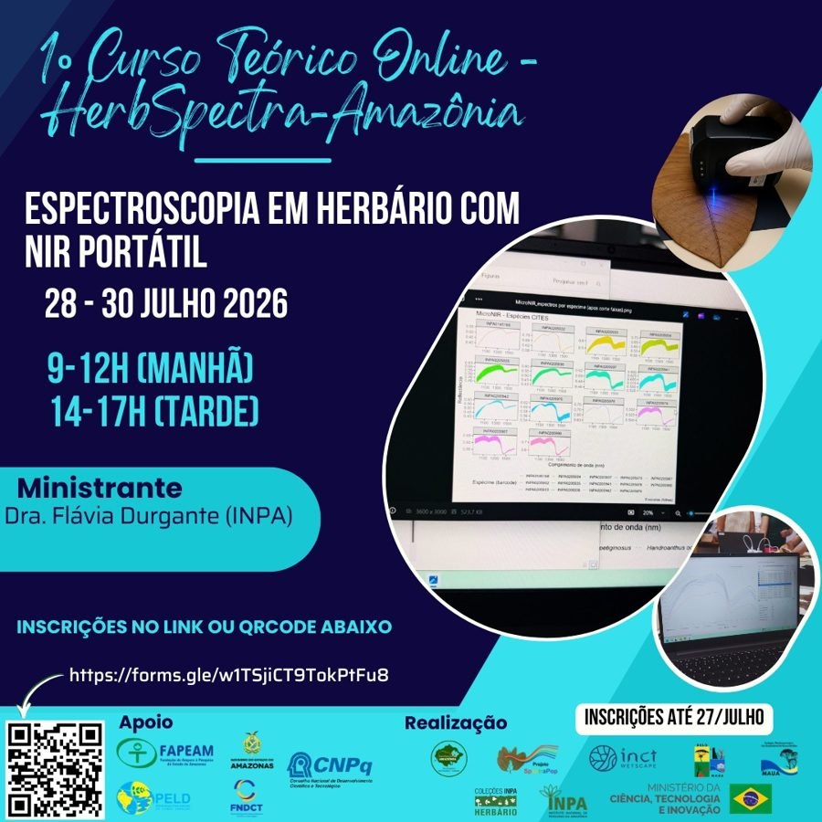

::: {.cabecalho .column-page}
[Resources]{.eyebrow}

# For learning and working with spectra

The protocol we follow, the tools we use to collect and analyse the data and the network’s open classes, all in one place.
:::

::: {.secao .column-page style="margin-top:2rem"}
::: recurso
::: recurso-txt
[Protocol]{.eyebrow}

## The iHerbSpec protocol

Every measurement in the network follows the **iHerbSpec Protocol for Spectral Digitization of Herbarium Specimens**, built by an international community of herbaria. It is the foundation of the protocol we use today in our courses and data collection.

The protocol standardizes the measurement workflow, file naming, metadata, instruments, tissue selection and quality control. This is what allows spectra measured in different herbaria to be combined into a single collection.

::: recurso-acoes
[Open the protocol <i class="bi bi-arrow-up-right"></i>](https://iherbspec.github.io/protocol.html){.btn-verde target="_blank"} [Archived version (Zenodo)](https://doi.org/10.5281/zenodo.18451589){.link-seta target="_blank"} [Paper: White et al. 2026](https://doi.org/10.32942/X2SD4D){.link-seta target="_blank"}
:::
:::

::: {.recurso-visual .visual-protocolo}
<span class="rv-sigla">iHerbSpec</span><span class="rv-sub">Protocol for Spectral Digitization of Herbarium Specimens</span><span class="rv-ver">v1.2.1 · CC BY 4.0</span>
:::
:::
:::

::: {.secao .column-page}
::: recurso
::: recurso-txt
[Tools · Data collection]{.eyebrow}

## herbflow NIR Collection Kit

A kit for collecting spectra and their metadata in a harmonized way: a collection spreadsheet, organization of readings and a generator of standardized artifacts, ready to archive and share, following the iHerbSpec protocol. Developed by Luiz Henrique Melo (INPA Herbarium).

[In development · v0.2.0 (in Portuguese)]{.selo}

::: recurso-acoes
[Open the guide <i class="bi bi-arrow-up-right"></i>](https://darthgrogu.github.io/herbflow-nir-collection-kit/){.btn-verde target="_blank"}
:::
:::

::: {.recurso-visual .visual-flow}
<span class="rv-sigla">herbflow</span><span class="rv-sub">NIR Collection Kit</span><span class="rv-ver">iHerbSpec</span>
:::
:::
:::

::: {.secao .column-page}
::: recurso
::: recurso-txt
[Tools · Analysis]{.eyebrow}

## ISClab

An online app to load herbarium measurements (including those organized with herbflow), review sessions and instruments, apply pre-processing (SNV, MSC, derivatives) and explore spectra by species, right in the browser.

[Test version (in Portuguese)]{.selo}

::: recurso-acoes
[Open ISClab <i class="bi bi-arrow-up-right"></i>](https://herbspectraamazonia.shinyapps.io/ISClab/){.btn-verde target="_blank"}
:::
:::

::: {.recurso-visual .visual-app}
<span class="rv-sigla">ISClab</span><span class="rv-sub">Shiny · R</span>
:::
:::
:::

::: {.secao .column-page}
[Talks]{.eyebrow}

## 2026 talk series

Open talks on spectroscopy, herbaria and biodiversity, streamed live and recorded on the network’s YouTube channel (in Portuguese).

```{=html}
<div class="videos">
<figure class="video-item"><div class="video"><a class="video-thumb" href="https://www.youtube.com/watch?v=Jcoeu5WsKOA" target="_blank" rel="noopener" aria-label="Talk 1 · Introduction to spectral studies in herbaria – Watch on YouTube"><span class="video-play"><i class="bi bi-play-fill"></i></span><span class="video-yt"><i class="bi bi-youtube"></i> Watch on YouTube</span></a></div><figcaption class="video-cap"><strong>Talk 1 · Introduction to spectral studies in herbaria</strong><br>Dr. Flávia Durgante (INPA)</figcaption></figure>
<figure class="video-item"><div class="video"><a class="video-thumb" href="https://www.youtube.com/watch?v=s3mldWRREVs" target="_blank" rel="noopener" aria-label="Talk 2 · Introduction to near-infrared (NIR) spectroscopy – Watch on YouTube"><span class="video-play"><i class="bi bi-play-fill"></i></span><span class="video-yt"><i class="bi bi-youtube"></i> Watch on YouTube</span></a></div><figcaption class="video-cap"><strong>Talk 2 · Introduction to near-infrared (NIR) spectroscopy</strong><br>Dr. Celio Pasquini</figcaption></figure>
</div>
```

[Visit the YouTube channel](https://www.youtube.com/@HerbSpectra-Amazonia){.link-seta target="_blank"}
:::

::: {.secao .column-page}
::: recurso
::: recurso-txt
[Online courses]{.eyebrow}

## Herbarium spectroscopy with portable NIR

The first HerbSpectra-Amazon online course took place on 28–30 July 2026, taught in Portuguese by Dr. Flávia Durgante (INPA). Upcoming online courses will be announced here and on our Instagram.

::: recurso-acoes
[Follow us on Instagram](https://www.instagram.com/herbspectraamazonia/){.link-seta target="_blank"}
:::
:::

::: {.recurso-visual .visual-foto}
{fig-alt="Poster of the first online course"}
:::
:::
:::
